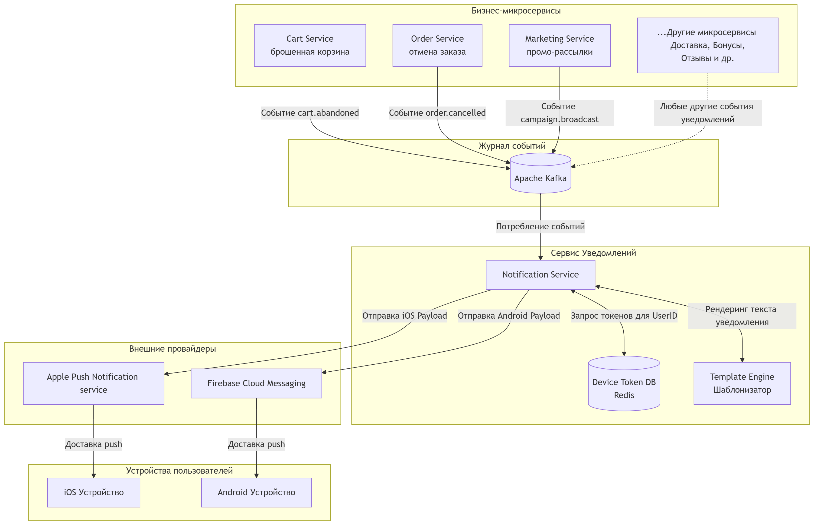

### Архитектурное решение: Модуль отправки PUSH-уведомлений
**Проект:** Мобильное приложение интернет-магазина «Петрушка Зеленая»

---

* Любой микросервис (заказы, корзина, маркетинг или новые сервисы) публикует событие в соответствующий топик **Apache Kafka**.
* **Notification Service** считывает события из Kafka, запрашивает актуальные PUSH-токены устройств получателя из **Базы токенов** и формирует текст сообщения.
* Сервер отправляет запросы на внешние шлюзы (**APNs** для iOS и **FCM** для Android), которые доставляют уведомления на устройства пользователей.